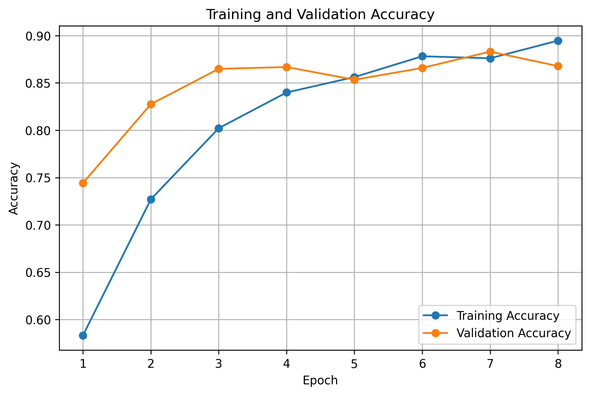
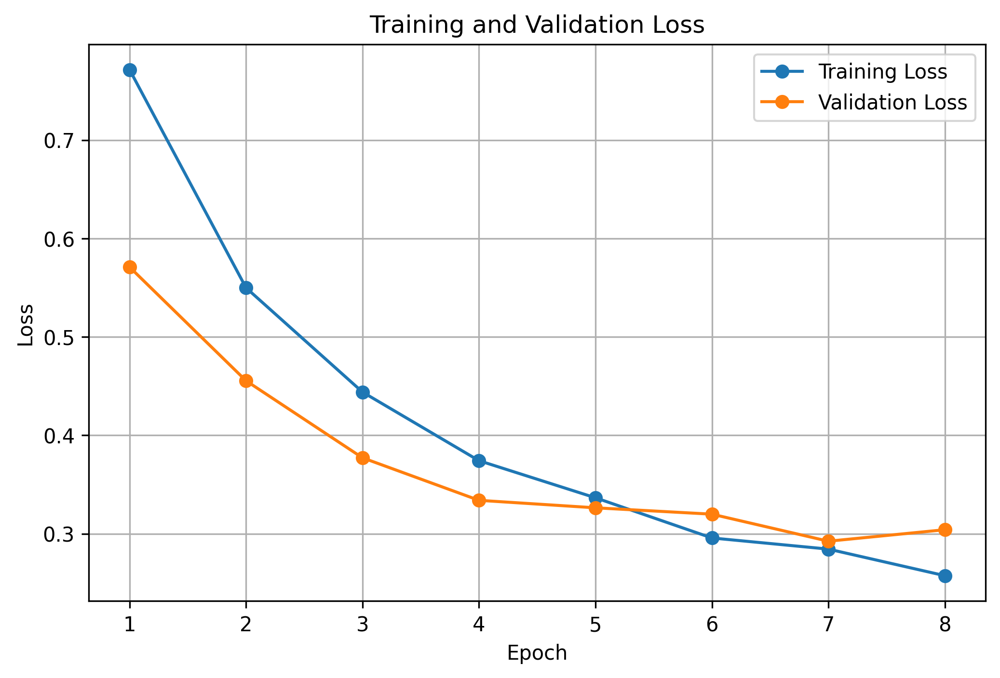
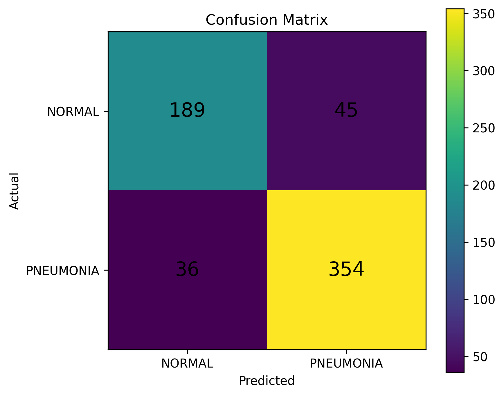

# Computer Vision for Pneumonia Detection
A project that uses deep learning to classify chest X-ray images as **normal** or **pneumonia**.

The goal of this project was to explore how computer vision and artificial intelligence can be applied to medical image classification.

The model receives a chest X-ray image and predicts whether it belongs to the normal or pneumonia category.

## Project Workflow
```text
Chest X-ray
     ↓
Image Preprocessing
     ↓
MobileNetV2
     ↓
Binary Classification
     ↓
NORMAL / PNEUMONIA
     ↓
Evaluation
```

## Dataset
The project uses the public Chest X-Ray Images (Pneumonia) dataset.

Final experiment:

* Training images: 4,180
* Validation images: 1,044
* Test images: 624
* Image size: 224 × 224 pixels
* Classes: normal and pneumonia

The dataset is not included.

## Model
I used **MobileNetV2** with pretrained ImageNet weights.

The pretrained convolutional base was frozen and a classification layer was added.

```text
MobileNetV2
     ↓
Global Average Pooling
     ↓
Dropout
     ↓
Dense Layer
     ↓
NORMAL / PNEUMONIA
```

Total parameters: **2,259,265**

Trainable parameters: **1,281**

## Preprocessing
Images were resized to 224 × 224 pixels and pixel values were normalized.

Training data was augmented using techniques such as rotation, zoom, shifting, and horizontal flipping.

## Training
The model was trained for 8 epochs.

The best model was selected based on validation loss.

Best validation loss: **0.2924**

Best validation accuracy: **88.31%**

## Test Results
The final model was evaluated on 624 unseen test images.

### Overall Performance
**Test Accuracy: 87.02%**

| Class     | Precision | Recall | F1-Score |
| --------- | --------: | -----: | -------: |
| NORMAL    |       84% |    81% |      82% |
| PNEUMONIA |       89% |    91% |      90% |
| Overall   |       87% |    87% |      87% |

### Confusion Matrix
```text
                    Predicted
                 NORMAL  PNEUMONIA

Actual NORMAL       189       45
Actual PNEUMONIA     36      354
```

The model correctly classified:

* 189 NORMAL images
* 354 PNEUMONIA images

It incorrectly classified:

* 45 NORMAL images as PNEUMONIA
* 36 PNEUMONIA images as NORMAL

## Training Results

### Accuracy



### Loss



### Confusion Matrix



## Limitations
* The dataset is limited compared with datasets used in clinical systems.
* The classes are not perfectly balanced.
* X-ray images can vary because of equipment, positioning, and image quality.
* A model trained on one dataset may not generalize to other hospitals or populations.
* The model has not been clinically validated.
* Prediction confidence should not be interpreted as medical certainty.
  
## Technologies
* Python
* TensorFlow / Keras
* MobileNetV2
* NumPy
* Pandas
* Matplotlib
* Scikit-learn
* OpenCV
* Google Colab
* GitHub

## Project Structure
```text
Pneumonia-AI/
│
├── README.md
├── train.py
├── predict.py
├── requirements.txt
├── .gitignore
│
└── results/
    ├── accuracy.png
    ├── loss.png
    └── confusion_matrix.png
```

## Disclaimer
This project is an educational demonstration.
